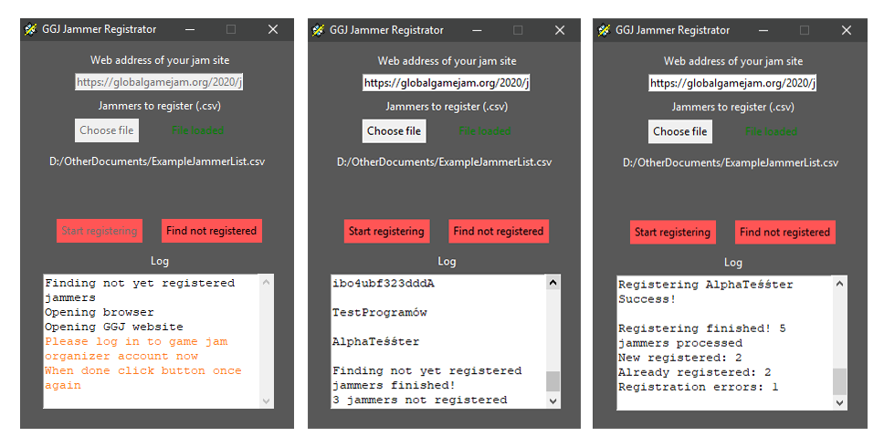
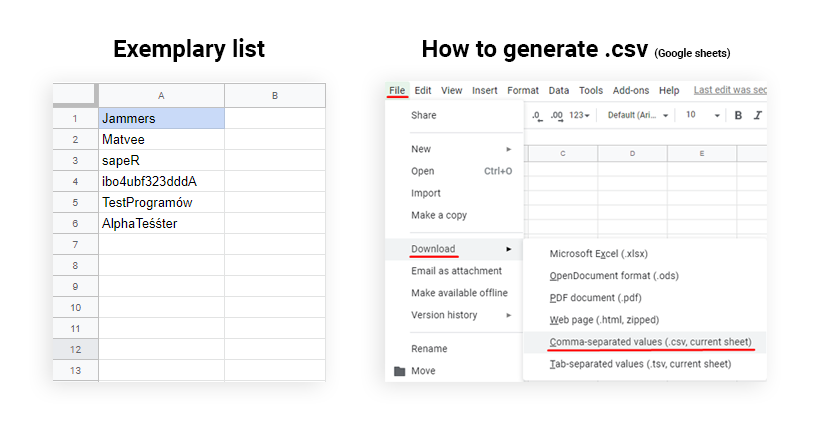

  

## Global Game Jam Jammer Registrator
Automatic registration tool for jamming sites organizers

If your site's registration is closed and you have to manually add all jammers who signed up you can use this tool to save some time

## How to use it
1. Download GGJJammerRegistrator.exe from this repository
2. Download Geckodriver from https://github.com/mozilla/geckodriver/releases
3. Put these two files in one directory
4. Download Firefox browser
5. Run GGJJammerRegistrator.exe, paste link to your game jam site, choose .csv file with list of jammers to register and hit start button
6. Log in to game jam organizer account when askedm hit button once again
7. Relax and watch how the program does the work for you

## How it works
It is just the bot that opens browser, enters website and registers new jammers.
It does this by finding appropriate elements (links, buttons, fields) in html code of the website.
All operations are printed in log box below, also it will automatically finish and print the results.

There are two modes of operation:
1. Registering jammers ("Start registering" button) - takes list of jammers from .csv file and tries to add them to the site.
2. Finding not yet registered jammers ("Find not registered" button) - takes list of jammers from .csv file and returns usernames of jammers that haven't been added yet.

## Notes
- .csv file should contain GGJ usernames of jammers, all in the first column and starting from the second row (so in first row can be some label) Exemplary file can be found in this repository
- The best way to generate .csv file is via exporting it from Google Sheets (see image example below)
- If you are interested in how this is programmed you can check the source code of this program. It is provided in this repository. It is open source software

 

  
   
  

