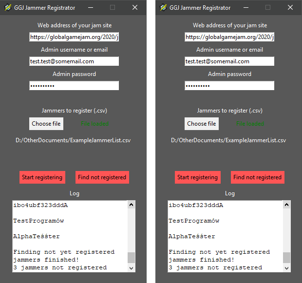
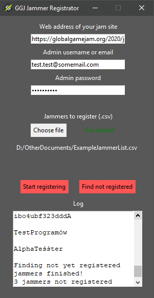
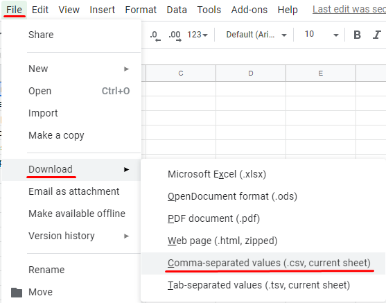
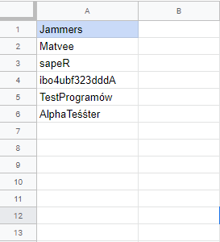

  

## Global Game Jam Jammer Registrator
Automatic registration tool for jamming sites organizers

If registration for your site is closed and you have to manually add all jammers who signed up you can use this tool to save some time

## How to use it
1. Download GGJJammerRegistrator.exe from this repository
2. Download Geckodriver from https://github.com/mozilla/geckodriver/releases
3. Put these two files in one directory
4. Download Firefox browser
5. Run GGJJammerRegistrator.exe, fill the fields with data, choose .csv file with list of jammers to register and hit start button
6. Relax and watch how the program does the work for you :D

## How it works
It is just the driver that opens browser, enters website, login into your account and register new jammers.
It does this by finding appropriate elements (links, buttons, fields) in html code of the website.
All operations are printed in log box below, also it will automatically finish and print the results.

There are two modes of operation:
1. Registering jammers ("Start registering" button) - takes list of jammers from .csv file and tries to add them.
2. Finding not yet registered jammers ("Find not registered" button) - takes list of jammers from .csv file and returns usernames of jammers that haven't been added yet.

## Notes
- .csv file should contain GGJ usernames of jammers, all in first column and starting from second row (so in first row can be some label) Exemplary file can be found in this repository

- The best way to generate .csv file is via exporting it from Google Sheets (see image example below)
- Don't worry it won't steal your login credentials :D. If you don't believe you can check the code of this program. It is open source software

  
  
  
  

